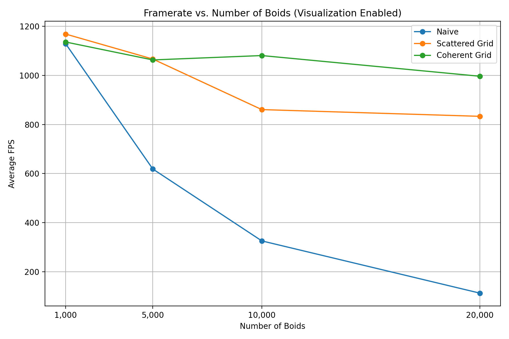
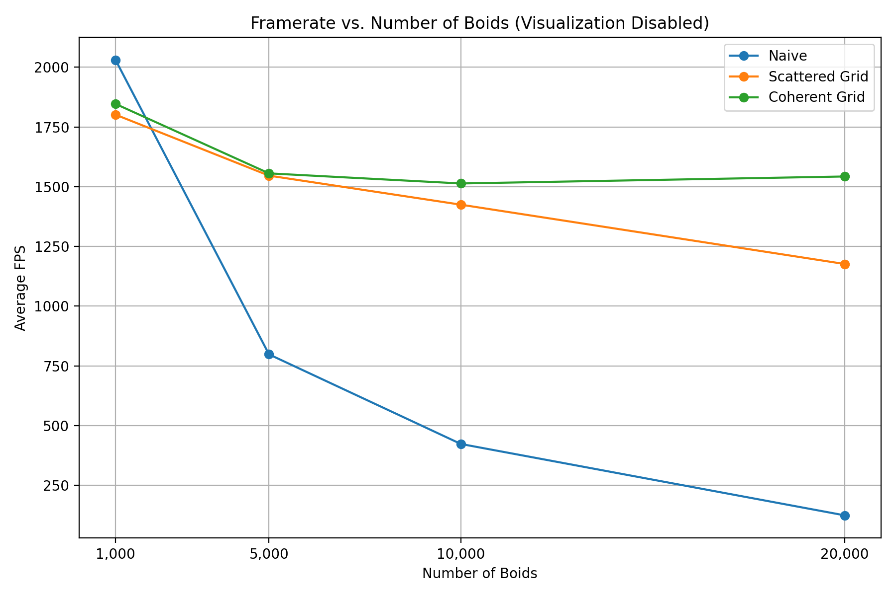
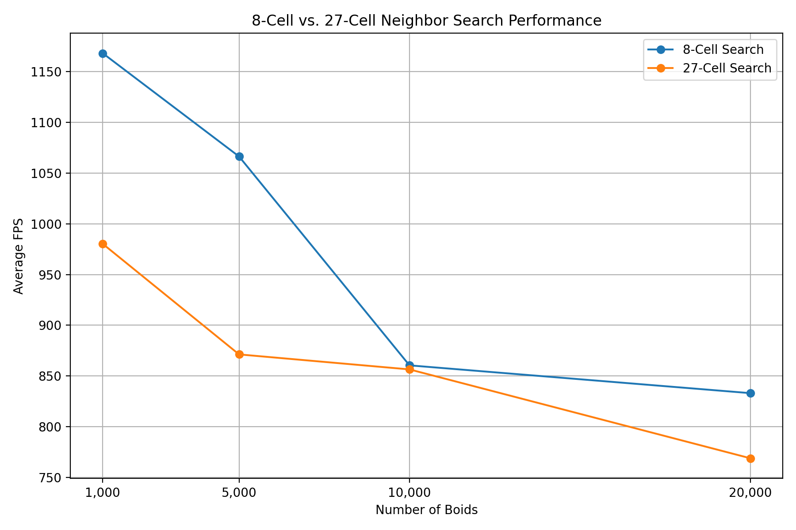
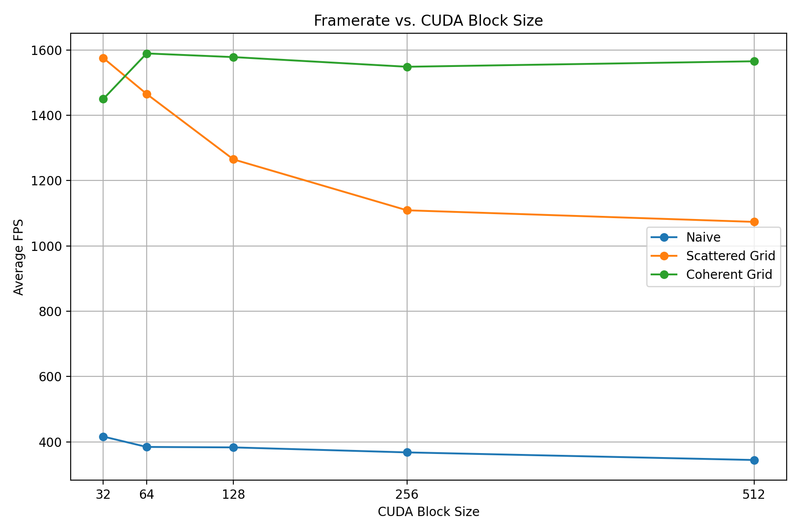

**University of Pennsylvania, CIS 5650: GPU Programming and Architecture,
Project 1 - Flocking**

* Yunzhe Deng
  * [LinkedIn](https://www.linkedin.com/in/yunzhedeng), [personal website](https://yunzhedeng.com)
* Tested on:  Windows 11, Intel Core i7-10750H @ 2.60GHz, 16 GB RAM, NVIDIA GeForce RTX 2060 (Personal Computer)

## 1. Framerate vs. Number of Boids

### 1.1 Visualization Enabled

#### 1.1.1 Experimental Data

##### Raw FPS Measurements (3 Runs)

| Number of Boids | Naive                  | Scattered Grid         | Coherent Grid          |
| --------------: | ---------------------- | ---------------------- | ---------------------- |
|           1,000 | 1212.1, 1113.8, 1060.8 | 1256.4, 1268.2, 980.0  | 1148.1, 1174.2, 1085.2 |
|           5,000 | 629.5, 611.8, 614.1    | 1091.2, 1043.8, 1064.2 | 1059.5, 1038.9, 1050.1 |
|          10,000 | 324.4, 327.2, 325.5    | 844.3, 856.2, 881.0    | 1090.2, 1086.3, 1065.2 |
|          20,000 | 117.0, 114.0, 108.0    | 879.5, 843.8, 775.9    | 970.0, 993.2, 1025.8   |

##### Average FPS

| Number of Boids |  Naive | Scattered Grid | Coherent Grid |
| --------------: | -----: | -------------: | ------------: |
|           1,000 | 1128.9 |         1168.2 |        1135.8 |
|           5,000 |  618.5 |         1066.4 |        1049.5 |
|          10,000 |  325.7 |          860.5 |        1080.6 |
|          20,000 |  113.0 |          833.1 |         996.3 |

#### 1.1.2 Performance Plot

### 1.2 Visualization Disabled

#### 1.2.1 Experimental Data

##### Raw FPS Measurements (3 Runs)

| Number of Boids | Naive                  | Scattered Grid         | Coherent Grid          |
| --------------: | ---------------------- | ---------------------- | ---------------------- |
|           1,000 | 2037.9, 2020.7, 2033.6 | 1793.3, 1813.4, 1797.3 | 1824.2, 1804.5, 1910.5 |
|           5,000 | 797.8, 807.6, 788.9    | 1553.2, 1545.1, 1540.3 | 1567.2, 1594.6, 1504.9 |
|          10,000 | 416.4, 440.7, 412.2    | 1311.1, 1479.0, 1483.8 | 1508.3, 1509.4, 1522.5 |
|          20,000 | 126.7, 120.8, 125.7    | 1201.7, 1170.5, 1156.9 | 1551.9, 1538.0, 1537.9 |

##### Average FPS

| Number of Boids |  Naive | Scattered Grid | Coherent Grid |
| --------------: | -----: | -------------: | ------------: |
|           1,000 | 2030.7 |         1801.3 |        1846.4 |
|           5,000 |  798.1 |         1546.2 |        1555.6 |
|          10,000 |  423.1 |         1424.6 |        1513.4 |
|          20,000 |  124.4 |         1176.4 |        1542.6 |

#### 1.2.2 Performance Plot

### 1.3 Analysis

#### Q: For each implementation, how does changing the number of boids affect performance? Why do you think this is?

A: The plots show that the naive implementation slows down much more as the number of boids increases. This happens because every boid checks all the others. The scattered and coherent grid methods perform better at larger N because they only search nearby cells. At small N, the naive method can still be competitive since the grid methods have extra setup and sorting cost.

#### Q: For the coherent uniform grid: did you experience any performance improvements with the more coherent uniform grid? Was this the outcome you expected? Why or why not?

A: The coherent grid performs better than the scattered grid, especially when the boid count is large. At 20,000 boids, it reaches about 1543 FPS compared with about 1176 FPS for the scattered grid. This is reasonable because nearby boids are stored closer together in memory, which makes memory access more efficient.

---

## 2. Grid Cell Width: 8-Cell vs. 27-Cell Search

The default implementation uses a cell width of 2× the maximum neighborhood distance and checks up to 8 cells.

For comparison, the cell width was reduced to 1× the maximum neighborhood distance, requiring checks of up to 27 neighboring cells.

### 2.1 Experimental Data

#### Raw FPS Measurements (3 Runs)

| Number of Boids | 8-Cell Search          | 27-Cell Search       |
| --------------: | ---------------------- | -------------------- |
|           1,000 | 1256.4, 1268.2, 980.0  | 1002.3, 948.4, 990.3 |
|           5,000 | 1091.2, 1043.8, 1064.2 | 858.8, 875.7, 879.3  |
|          10,000 | 844.3, 856.2, 881.0    | 871.0, 874.8, 823.8  |
|          20,000 | 879.5, 843.8, 775.9    | 805.8, 760.3, 740.5  |

#### Average FPS

| Number of Boids | 8-Cell Search | 27-Cell Search |
| --------------: | ------------: | -------------: |
|           1,000 |        1168.2 |          980.3 |
|           5,000 |        1066.4 |          871.3 |
|          10,000 |         860.5 |          856.5 |
|          20,000 |         833.1 |          768.9 |

### 2.2 Performance Plot

### 2.3 Analysis

#### Q: Did changing cell width and checking 27 vs 8 neighboring cells affect performance? Why or why not?

A: From the graph, the 8-cell version is faster overall, but the gap is not always large. The 27-cell version checks more cells, but each cell is also smaller and contains fewer boids. This means each cell search may involve fewer boid comparisons. Because of that, the extra cost of checking more cells is partly balanced by doing less work inside each cell. This is why the 27-cell version is not always much slower than the 8-cell version.

---

## 3. Framerate vs. CUDA Block Size

For this experiment:

- N = 10000
- VISUALIZE = 0

### 3.1 Experimental Data

#### Raw FPS Measurements (3 Runs)

| Block Size | Naive               | Scattered Grid         | Coherent Grid          |
| ---------: | ------------------- | ---------------------- | ---------------------- |
|         32 | 414.0, 417.0, 417.9 | 1572.4, 1574.2, 1579.6 | 1475.9, 1420.5, 1452.6 |
|         64 | 388.0, 383.2, 381.9 | 1462.5, 1475.0, 1458.4 | 1588.9, 1612.2, 1566.9 |
|        128 | 384.2, 383.4, 381.4 | 1298.3, 1271.0, 1225.4 | 1577.6, 1572.8, 1583.9 |
|        256 | 369.8, 366.9, 366.3 | 980.4, 1154.8, 1191.8  | 1538.8, 1540.0, 1566.7 |
|        512 | 351.9, 344.0, 337.4 | 1125.7, 1054.2, 1040.6 | 1562.2, 1555.0, 1578.6 |

#### Average FPS

| Block Size | Naive | Scattered Grid | Coherent Grid |
| ---------: | ----: | -------------: | ------------: |
|         32 | 416.3 |         1575.4 |        1449.7 |
|         64 | 384.4 |         1465.3 |        1589.3 |
|        128 | 383.0 |         1264.9 |        1578.1 |
|        256 | 367.7 |         1109.0 |        1548.5 |
|        512 | 344.4 |         1073.5 |        1565.3 |

### 3.2 Performance Plot

### 3.3 Analysis

#### Q: For each implementation, how does changing the block count and block size affect performance? Why do you think this is?

A: From the graph, increasing the block size generally lowers the performance of the naive and scattered grid implementations. The scattered grid shows the biggest drop, from about 1575 FPS at block size 32 to about 1074 FPS at 512. The naive version also decreases, but not as much. The coherent grid is much more stable. Its performance stays around 1550–1590 FPS for block sizes from 64 to 512, with 64 giving the best result. Because the total number of boids stays the same, using a larger block size means fewer blocks are needed. This affects how the GPU schedules the work. From the results, different implementations react differently to block size, while the coherent grid stays almost the same for most block sizes.

## Build Notes

`CMakeLists.txt` was modified to fix CUDA build issues on Windows. The CUDA toolkit include directory was added, `CUDAToolkit` was explicitly located, and `CUDA::cudart` was linked to the executable.
